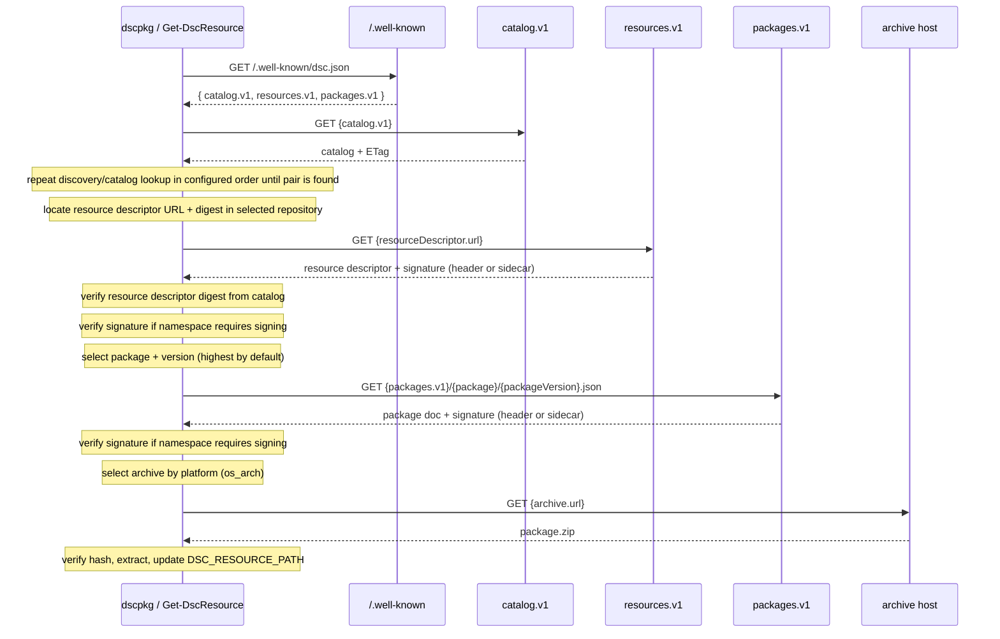
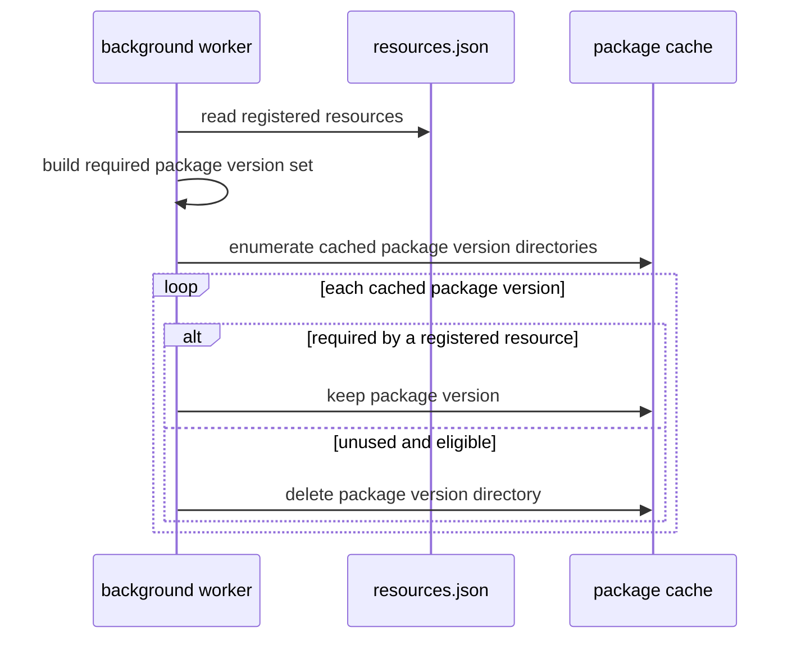

# Design: DSC Resource Repository

## Summary

DSC needs a portable way to acquire the content that provides a DSC resource type
at runtime. This design defines a **DSC Resource Repository**: an HTTP-accessible,
static content repository that publishes resource descriptors, package descriptors,
and platform-specific package archives. It requires no server-side application or
control plane and can be hosted on object storage, a CDN, or an ordinary web server.

The tool is named **`dscpkg`**. It resolves resource identities to packages, downloads
and verifies the appropriate archives, and makes their resources discoverable by DSC.
The repository model can support a provider for DSC's planned automatic resource
acquisition extensibility points; this proposal does not define that DSC contract.
Resource-to-package mapping remains an internal concern of this acquisition approach.

This document describes repository discovery, content APIs, and the on-disk layout.

## Goals

- Resolve a **resource type + version** (e.g. `Microsoft.GuestConfiguration/users` @
  `2026-06-30-preview`) to a concrete, platform-specific package archive.
- Download, integrity-check, and extract packages into a predictable layout.
- Make installed resources discoverable by the DSCv3 engine via `DSC_RESOURCE_PATH`.
- Track locally registered resources so the client can periodically discover package
  updates for resources already in use.
- Clean up cached package versions that are no longer required by any registered
  resource.
- Discover service endpoints dynamically so the client is not hard-coded to a single
  environment (public cloud, sovereign cloud, or a local test server).

## Non-goals

- Package authoring, signing, or publishing (server-side concerns).
- Dependency resolution across multiple packages — the current flow assumes **one
  package per resource type**.

## Advantages

- **Completely static content.** Every endpoint in this flow — the discovery document,
  the catalog, the resource descriptor, the package documents, and the archives themselves —
  is a static file. There is no server-side application logic, database, or dynamic
  request handling required. The entire repository can be hosted on any blob store or CDN,
  which makes it cheap, highly available, trivially cacheable, and easy to mirror.
- **Customers can host their own content repository.** Because the layout is just
  static files following a predictable path convention, a customer can stand up their
  own repository (e.g. a blob container or an internal CDN) and point the client at it
  through its configured repository origins. This enables air-gapped/sovereign
  deployments, private package catalogs, and local testing without specialized
  server software.

## Terminology

| Term | Meaning |
|------|---------|
| **Resource type** | The DSC resource identity, `Namespace/name`, e.g. `Microsoft.GuestConfiguration/users`. |
| **Resource descriptor** | Repository metadata mapping a resource type + version to the package versions that provide it; distinct from a DSC `*.dsc.resource.json` resource manifest. |
| **Package** | A versioned, named unit of content (e.g. `microsoft.guestconfiguration/azresources`) shipped as per-platform archives. |
| **Archive** | A `.zip` for a specific `os_arch` platform, with integrity hashes. |
| **Platform key** | `os_arch`, e.g. `windows_amd64`, `linux_amd64`, `linux_arm64`. |
| **Discovery document** | `/.well-known/dsc.json`, lists versioned API endpoints. |
| **DSC Resource Repository** | An HTTP-accessible static content repository publishing the discovery document, catalog, resource descriptors, package descriptors, and archives. |
| **Catalog** | Repository-level index that maps resource type + version pairs to resource descriptors and their content digests. |
| **Local resource registry** | Client-managed JSON file listing the resource type + version pairs currently registered on the machine. |

### Why resource descriptors and packages are separate

DSC resources are addressed by **resource type** (`Microsoft.GuestConfiguration/users`),
but content is distributed as **packages**. These are not 1:1 — a single package can
implement several resource types. The **resource descriptor** is the mapping layer that resolves a
resource type + version to the specific package and version that provides it, so the
client knows what to download. Each package, in turn, ships a **separate `.zip` archive
for every platform it supports**, selected at download time by the `os_arch` key.

## Configuration

The client is configured with:

- **API version** — encoded as the discovery document keys it understands
  (`catalog.v1`, `resources.v1`, `packages.v1`).
- **Repositories** — an ordered list of repository origins. A value may be a bare
  hostname (defaults to `https://`) or a full base URL including scheme and port
  (e.g. `http://127.0.0.1:8080` for a local test server). Repository precedence is
  evaluated for each requested resource type + version, as described below.
- **Packages directory** — the root the client extracts packages into.
- **Local resource registry** — a JSON file containing the resource type + version
  pairs that should be kept available on the machine.

### Repository precedence

`dscpkg` searches repositories in configured order for the requested **resource type +
version**. The first repository whose catalog contains that exact pair wins. A reachable
discovery document alone does not select a repository. For example, an internal mirror
can precede a public repository; if the mirror lacks the requested pair, lookup proceeds
to the public repository. The client does not combine package versions across repositories
or select a later repository merely because it advertises a newer package version.

- A repository with no discovery document or a valid catalog without the requested pair
  is skipped. Network failures, authorization failures, malformed metadata, and integrity
  or signature failures are errors rather than silent fallback.
- Once a repository is selected, its resource descriptor and package endpoint are used
  for that resolution. Relative URLs are resolved against the containing document URL;
  explicit absolute URLs may point to separate metadata or archive hosts.
- Namespace signing policy applies independently of repository location. Selecting an
  internal repository or mirror does not establish publisher trust or relax a required
  signature. Verification failure must not trigger fallback to another repository.
- Update checks repeat the same ordered lookup for each registered resource. Catalog
  bodies and ETags are cached per catalog URL, not shared across repositories. A `304`
  from one repository only means that repository's catalog is unchanged; the client must
  still evaluate precedence using its cached catalog and any other relevant repositories.

Repository order therefore allows deliberate shadowing by an earlier repository, subject
to the namespace trust policy. Configure trusted repository origins explicitly.

## Flow



Step by step:

1. The client is coded against an API version (the discovery document version keys).
2. The client is configured with an ordered list of repository origins and a packages directory.
3. **Repository discovery** — for each configured origin, fetch
   `GET {host}/.well-known/dsc.json` and its catalog until the requested resource type +
   version is found, following [repository precedence](#repository-precedence).
4. The client is given a **resource type and version**
   (`dscpkg install "Microsoft.GuestConfiguration/users" --version "2026-06-30-preview"`).
5. **Catalog lookup** — fetch `{catalog.v1}` and locate the resource descriptor URL and
   digest for the requested resource type and version.
6. **Resource descriptor discovery** — fetch the resource descriptor listed in the catalog, verify its
   digest, and select the package (and version — highest available unless one is
   requested).
7. **Signature verification (resource descriptor)** — locate the detached JWS for the resource descriptor
   document and validate it against the signing policy for the resource namespace, if one
   is active. See [Content signing](#content-signing).
8. **Package discovery** — construct `{packages.v1}/{package}/{packageVersion}.json`.
9. **Signature verification (package)** — locate the detached JWS for the package
   document and validate it against the signing policy for the package namespace, if one
   is active.
10. **Platform selection** — pick the archive whose key matches the target `os_arch`.
11. **Download + verify** — download the archive and verify its hash.
12. **Extract** — into `{packagesDir}/{package}/{packageVersion}/`.
13. **Expose** — prepend/append the package version directory to `DSC_RESOURCE_PATH`.
14. **Register** — record the requested resource type, version, and resource descriptor `digest` in
    the local resource registry so future update checks can re-resolve it.

## API contracts

### Discovery — `GET /.well-known/dsc.json`

```json
{
  "catalog.v1": "https://resources.example.com/v1/catalog.json",
  "resources.v1": "https://resources.example.com/v1/resources",
  "packages.v1": "https://resources.example.com/v1/packages"
}
```

### Catalog — `GET {catalog.v1}`

The catalog is the repository-level index of available resource descriptors. It should
include an `ETag` response header so clients can use `If-None-Match` for periodic update
checks. Any publish that adds, removes, or changes a resource descriptor must publish an
updated catalog.

The catalog `ETag` is an HTTP validator for the catalog response. It is separate from
the per-entry `digest`, which identifies the referenced resource descriptor content.

Catalog entries include a resource descriptor `url` and a content `digest`. The digest uses
the same `algorithm:hex` format as archive hashes and identifies the exact resource descriptor
bytes referenced by the catalog.

```json
{
  "resources": {
    "microsoft.guestconfiguration/users": {
      "2026-06-30-preview": {
        "url": "resources/microsoft.guestconfiguration/users/2026-06-30-preview.json",
        "digest": "sha256:<hex>"
      }
    }
  }
}
```

- `url` may be **relative** (resolved against the catalog document URL) or **absolute**.
- `digest` is checked after downloading the resource descriptor and before acting on it.

### Resource descriptor — `GET {resources.v1}/{resource}/{version}.json`

All path segments are **lowercased**. Because the content is served as static files
(e.g. from Azure Blob Storage, whose blob names are case-sensitive), there is a single
canonical casing — all lowercase — for every path. Publishers write blobs using
lowercase paths, and clients lowercase the resource type, version, and package values
before constructing URLs. This avoids case-mismatch 404s without needing any
case-normalizing layer in front of the store.

```
GET https://.../v1/resources/microsoft.guestconfiguration/users/2026-06-30-preview.json
```

```json
{
  "packages": {
    "microsoft.guestconfiguration/azresources": {
      "versions": {
        "1.0.0": {},
        "1.0.1": {}
      }
    }
  }
}
```

### Package — `GET {packages.v1}/{package}/{packageVersion}.json`

```
GET https://.../v1/packages/microsoft.guestconfiguration/azresources/1.0.1.json
```

```json
{
  "archives": {
    "windows_amd64": {
      "url": "relative-or-absolute-uri.zip",
      "hashes": [ "sha256:<hex>" ]
    },
    "linux_amd64": {
      "url": "relative-or-absolute-uri.zip",
      "hashes": [ "sha256:<hex>" ]
    },
    "linux_arm64": {
      "url": "relative-or-absolute-uri.zip",
      "hashes": [ "sha256:<hex>" ]
    }
  }
}
```

- `url` may be **relative** (resolved against the package document URL) or **absolute**.
- `hashes` is a list of `algorithm:hex` entries. The client treats verification as
  successful when any one entry matches; a present-but-mismatching hash is a hard error.

## Repository layout

Because all content is static, the entire repository maps directly to a predictable
directory tree rooted at the repository base URL. The following illustrates a minimal
repository serving one resource type and one package:

```
/.well-known/
  dsc.json
/v1/catalog.json
/v1/resources/
  microsoft.guestconfiguration/
    users/
      2026-06-30-preview.json
/v1/packages/
  microsoft.guestconfiguration/
    azresources/
      1.0.0.json
      azresources_1.0.0_windows_amd64.zip
      azresources_1.0.0_linux_amd64.zip
      azresources_1.0.0_linux_arm64.zip
```

A customer-hosted mirror reproduces this same tree under whatever base URL they
control. The client derives every request URL from the base URLs in the discovery
document, so the physical hosting location (Azure Blob container, S3 bucket, internal
CDN, local test server) is transparent to the client.

## Content signing

### Overview

Because customers can host their own mirrors, a malicious or compromised mirror could
serve tampered metadata for first-party namespaces. To guard against this, the client
enforces **signing policies** for select namespaces. A policy binds a namespace prefix
(e.g. `microsoft.guestconfiguration`) to a set of trusted public keys. When a policy is
active for a namespace, the client requires that resource descriptor and package documents from
that namespace carry a valid detached JWS before their contents are acted on.

Signing covers the **resource descriptor** and **package** JSON documents. Archive integrity is
already covered by the `hashes` field embedded in the trusted package document — once
the document itself is authenticated, its hashes are trusted.

### Signature format

Signatures use **detached JWS** (RFC 7515 §6). The compact serialization takes the form
`header..signature` — the payload field is empty — and the signing input is the exact
raw bytes of the JSON document body as received from the server (no canonicalization or
re-encoding). The algorithm is declared in the JOSE header (`alg`; e.g. `ES256`).

### Signature sources

The client checks the following sources in priority order, using the first it finds:

| Priority | Source | Notes |
|----------|--------|-------|
| 1 | `content-signature` response header | Primary scenario; any origin that controls response headers can set this. |
| 2 | `x-ms-meta-content-signature` response header | Azure Blob Storage — add `Content-Signature` as blob metadata; Storage surfaces it with the `x-ms-meta-` prefix. |
| 3 | `x-azm-meta-content-signature` response header | S3-compatible hosting — equivalent metadata convention. |
| 4 | Sidecar file `{documentUrl}.jws` | Fallback for origins that cannot inject custom headers; the client makes a second `GET` for the same URL with a `.jws` suffix appended. |

If a signing policy is active for the namespace and no signature is found from any
source, the document is rejected with an actionable error.

### Signing policy configuration

Policies are distributed through two complementary mechanisms:

- **Bundled** with the client — a built-in table of first-party namespaces and their
  trusted public keys ships with the binary. This protects those namespaces even when the
  client is connecting to a customer-hosted mirror, without any additional setup.
- **Discovery document** — the `.well-known` response may include a `signing-policies.v1`
  endpoint. When present, the client fetches the policy list from there and merges it with
  the bundled set (bundled entries take precedence for the same namespace).

A signing policy entry specifies:

```json
{
  "namespace": "microsoft.guestconfiguration",
  "required": true,
  "keys": [
    {
      "kid": "<key id>",
      "kty": "EC",
      "crv": "P-256",
      "x": "<base64url>",
      "y": "<base64url>"
    }
  ]
}
```

`required: true` means any document from that namespace must be signed by one of the
listed keys. `required: false` means signatures are validated when present but are not
mandatory (useful for gradual rollout or opt-in validation without blocking unsigned
publishers).

### Verification algorithm

1. Derive the namespace from the resource type or package name (the lowercased segment
   before the first `/`).
2. Look up the signing policy for that namespace. If none exists, skip verification.
3. Probe the [signature sources](#signature-sources) in priority order. Stop at the first
   non-empty value found.
4. If `required: true` and no signature was found, fail with an actionable error naming
   the namespace and listing the sources that were checked.
5. Parse the JWS compact serialization and re-attach the raw document bytes as the
   detached payload.
6. Verify the signature against each key in the policy; succeed on the first match.
7. If all keys fail to verify, reject the document.

## On-disk layout

```
{packagesDir}/
  resources.json
  {package}/
    {packageVersion}/
      <extracted package contents>
```

The leaf `{packageVersion}` directory is what gets added to `DSC_RESOURCE_PATH`
(`;`-separated on Windows, `:`-separated elsewhere). Insertion is idempotent — an
already-present path is not duplicated.

### Local resource registry

`resources.json` is the local registry of resources that are registered on the
machine. The registry stores the durable resource intent — the resource type and
resource version — plus an optional `digest` recording the last resource descriptor digest
processed from the catalog. Package names, package versions, archive URLs, hashes, and
runtime paths are derived from the catalog, resource descriptor, package documents, and on-disk
package cache.

```json
{
  "resources": [
    {
      "resource": "foo/bar",
      "version": "2026-01-01",
      "digest": "sha256:<hex>"
    }
  ]
}
```

The registry is not a package database. A package may provide multiple resources, and a
resource may move to a different package version or package name over time. On each
update check, the client re-resolves every registered `resource` + `version` through the
catalog and resource descriptor and treats the result as the current desired package set. If
the catalog digest for a registered resource matches the local `digest`, no package
update is needed for that resource. If the local package state is missing or suspect,
the client ignores the local `digest` and re-resolves the resource from the catalog and
resource descriptor.

### Background update and cleanup

A background process periodically refreshes registered resources:

```mermaid
sequenceDiagram
  participant Worker as background worker
  participant Registry as resources.json
  participant Disc as /.well-known
  participant Cat as catalog.v1
  participant Mod as resources.v1
  participant Pkg as packages.v1
  participant CDN as archive host
  participant Cache as package cache

  Worker->>Registry: read registered resources
  Note over Worker: resolve repository precedence per resource; cache catalogs and ETags per URL
  Worker->>Disc: GET /.well-known/dsc.json
  Disc-->>Worker: { catalog.v1, resources.v1, packages.v1 }
  Worker->>Cat: GET {catalog.v1} with If-None-Match
  alt catalog unchanged
    Cat-->>Worker: 304 Not Modified
    Note over Worker: use cached catalog for precedence; skip only if selected resolution is unchanged and intact
  else catalog changed
    Cat-->>Worker: catalog + ETag
    loop each registered resource
      Note over Worker: lookup resource descriptor URL + digest in catalog
      alt catalog digest matches local digest
        Note over Worker: no package update needed
      else catalog digest changed or local digest is missing
        Worker->>Mod: GET {resourceDescriptor.url}
        Mod-->>Worker: resource descriptor + signature
        Note over Worker: verify resource descriptor digest from catalog
        Note over Worker: verify signature if namespace requires signing
        Note over Worker: select desired package + version
        Worker->>Registry: update digest for resource
        alt selected package version is cached
          Worker->>Cache: reuse existing package version directory
        else selected package version is missing
          Worker->>Pkg: GET {packages.v1}/{package}/{packageVersion}.json
          Pkg-->>Worker: package doc + signature
          Note over Worker: verify signature if namespace requires signing
          Note over Worker: select archive by platform (os_arch)
          Worker->>CDN: GET {archive.url}
          CDN-->>Worker: package.zip
          Worker->>Cache: verify hash and extract atomically
        end
      end
    end
  end
  Worker->>Cache: regenerate DSC_RESOURCE_PATH from resolved package versions
```

1. Read `resources.json` and evaluate [repository precedence](#repository-precedence)
   for each registered resource.
2. Fetch `{catalog.v1}`, using `If-None-Match` when a catalog `ETag` is available.
3. If a catalog returns `304 Not Modified`, use its cached body for precedence lookup;
   skip package updates only when the selected repository and resource digest are unchanged
   and local package state is intact.
4. If the catalog returns `200 OK`, look up every registered resource in the catalog.
5. If the catalog digest matches the local `digest`, skip when package state is intact.
6. If the catalog digest changed or the local `digest` is missing, fetch the resource descriptor
   URL from the catalog and verify its digest.
7. Verify the resource descriptor signature when required by policy.
8. Select the desired package version from the resource descriptor, using the same version
   selection rules as the install flow.
9. Update the registered `digest` from the catalog entry.
10. Fetch and verify the package document for any desired package version that is not
   already present in the package cache.
11. Download, hash-check, and extract missing archives atomically.
12. Regenerate the active `DSC_RESOURCE_PATH` entries from the resolved package versions.

The same pass can clean up cached packages that are no longer needed:



1. Build the set of package version directories required by all registered resources.
2. Compare that set with the package versions present under `{packagesDir}`.
3. Delete cached package versions that are not required by any registered resource, after
   any configured grace period or rollback retention policy.

Cleanup must not remove a package version that is currently active in
`DSC_RESOURCE_PATH` or in use by a running resource operation. If an update fails at any
point, the previously active package version remains available.

### Package zip contents

A package archive extracts to a flat directory. The directory name matches the package
name (the segment after the namespace `/`). A concrete example for a
`microsoft.guestconfiguration/local-connector` package:

```
microsoft.guestconfiguration.local-connector/
  1.0.1/
    local-connector.exe                                    # implementation binary
    Microsoft.GuestConfiguration.Groups.dsc.resource.json  # DSC resource manifest for Groups
    Microsoft.GuestConfiguration.Users.dsc.resource.json   # DSC resource manifest for Users
    groups.local-connector.config.json                     # runtime config for the Groups resource
    users.local-connector.config.json                      # runtime config for the Users resource
```

| File | Purpose |
|------|---------|
| `*.exe` / native binary | The implementation the DSC engine invokes to get/set resource state. |
| `*.dsc.resource.json` | DSC resource manifest — declares the resource type, schema, and which binary to invoke. One file per resource type the package provides. |
| `*.config.json` | Resource-specific configuration consumed by the binary at runtime (e.g. which data source or connector settings to use). |

Because the extracted directory is added to `DSC_RESOURCE_PATH`, the DSC engine can
discover all `*.dsc.resource.json` manifests in the directory automatically.

## Security considerations

- **Content signing** — resource descriptor and package documents from namespaces covered by a
  signing policy are verified against trusted public keys before use. This prevents a
  customer-hosted mirror from serving tampered first-party metadata even when TLS alone
  cannot be fully trusted (e.g. corporate networks with TLS inspection). See
  [Content signing](#content-signing).
- **Integrity** — every archive is hash-verified before extraction; an archive without
  hashes is rejected.
- **Transport** — bare hostnames default to HTTPS. Plain `http://` is supported only
  when explicitly supplied (intended for local test servers).
- **Path safety** — extraction targets a per-package/per-version directory; zip-slip
  protection should be considered if archives come from untrusted sources.

## Open questions / future work

- Multiple packages per resource type (dependency graph).
- Signing policy distribution — whether `signing-policies.v1` is included in the
  discovery document or shipped only as a bundled list (or both).
- Key rotation — how public keys in the bundled policy are updated when the signing key
  changes, and whether a `signing-policies.v1` endpoint can override bundled keys for
  active rotation.
- Cache retention policy — how long unused package versions are kept for rollback before
  cleanup removes them.
- Optional persistent `DSC_RESOURCE_PATH` configuration.

## References

- This design is inspired by Terraform's
  [Provider Network Mirror Protocol](https://developer.hashicorp.com/terraform/internals/provider-network-mirror-protocol),
  which similarly serves provider metadata and per-platform archives as static content
  discovered via a `.well-known` document and a predictable URL layout.